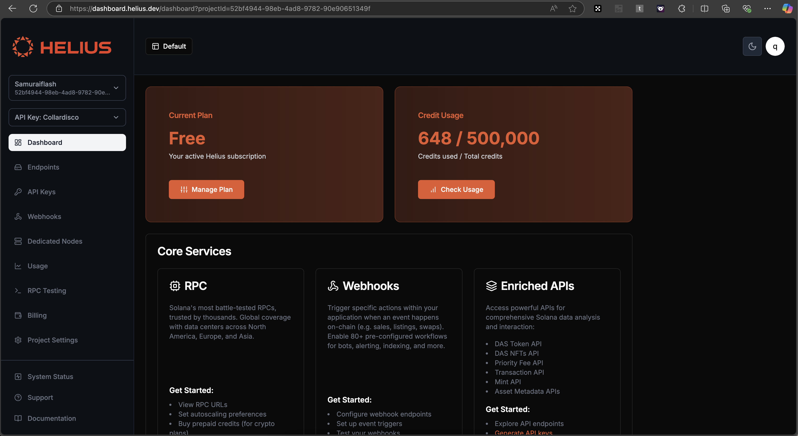
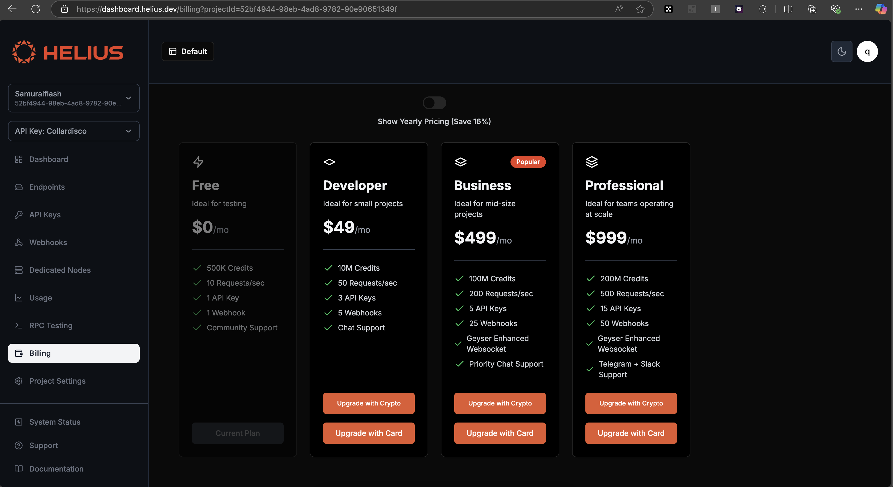
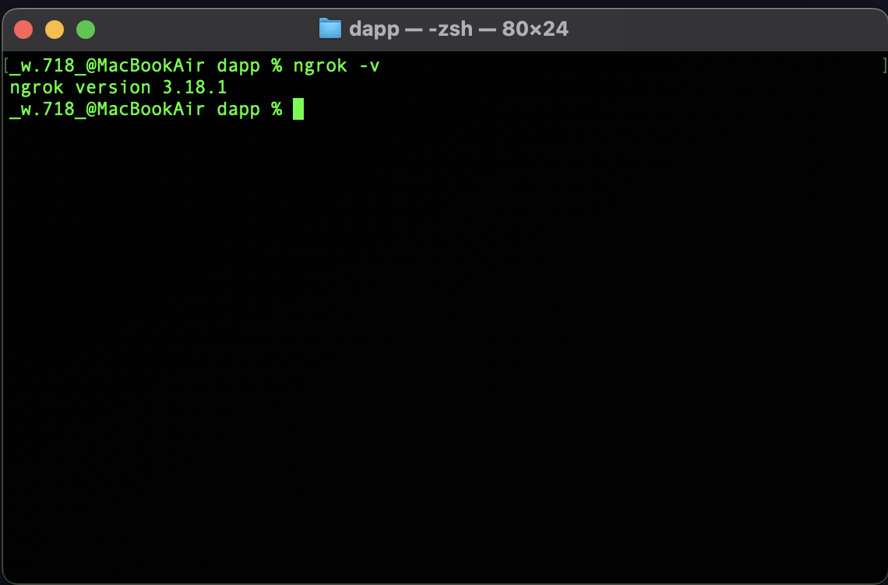
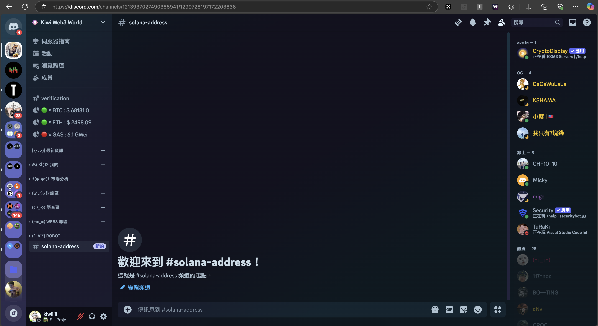
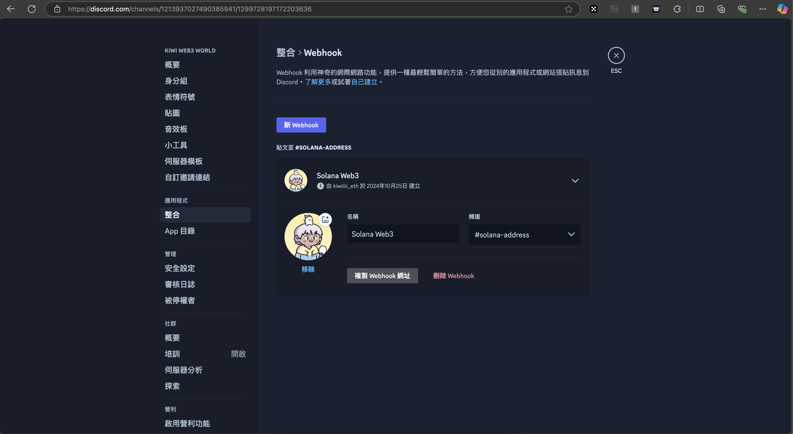
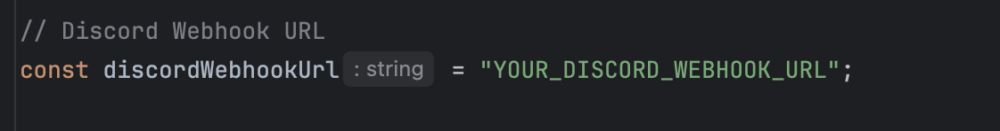
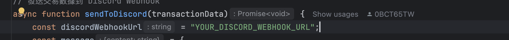
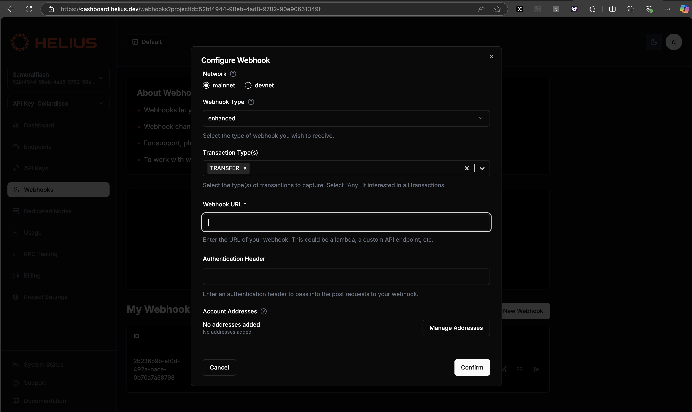
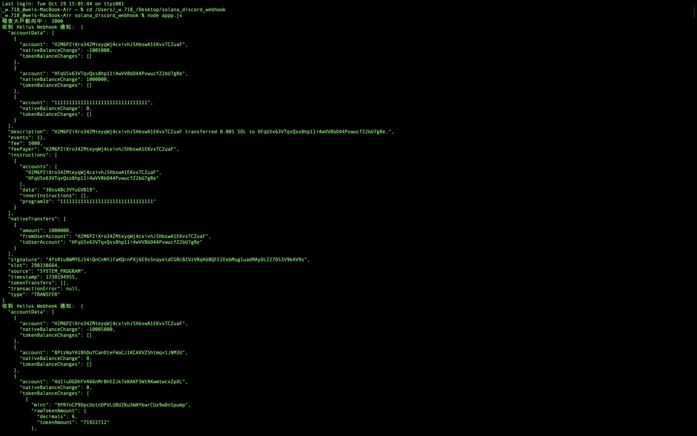
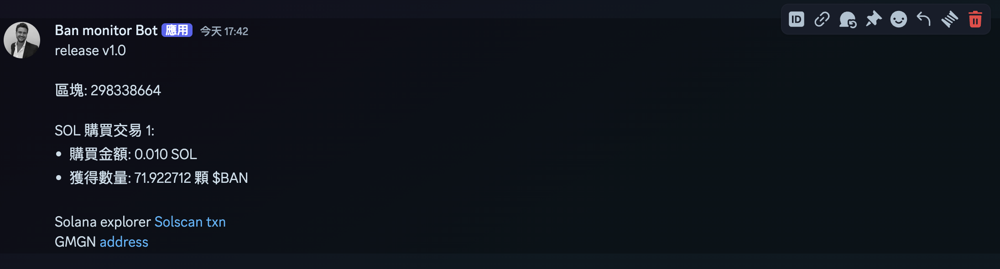

# Solana-Helius-Discord-Webhook

## What is This ? What can it do ?

You can setup your Discord Channel Webhook, \
to follow smart money address in your Discord Channel. \
will to address transactions to the Blockchain. \
your Discord Channel will be notified. 

## What Should I Do First ?
1. [X] Sign up Helius Account! [Helius-official-website](https://dashboard.helius.dev/)

2. [X] Choose your plan (You can Choose Free Plan to Practice)

3. [X] Download Ngrok and Setup it [Ngrok-official-website](https://ngrok.com/)



### Setup Discord webhook
1. [X] Create a Discord Channel

2. [X] Setup Webhook and Copy Webhook URL

3. [X] Paste Discord Webhook URL to app.js & discord.js



### Setup Helius
1. [X] Setup Helius Websocket URL and Smart Money Address


### Total setup

```git clone https://github.com/kiwiiiii-eth/Solana-Helius-Discord-Webhook.git``` \
```cd Solana-Helius-Discord-Webhook``` \
```npm install express axios app port``` \
```node app.js``` \
```ngrok http 3000```

### Copy Ngrok URL and Paste it to Helius Websocket URL

### success !!
